# 🚀 Installation Guide
**Get Ableton MCP Extended running in under 10 minutes**

> 🎵 **Want to see what's possible first?** Check out our [capabilities demonstration video](#-capabilities-demonstration) to see Ableton MCP Extended in action before installing!

---

## 📋 Pre-Installation Checklist

Before we start, make sure you have:

- [ ] **Ableton Live 11 or newer** (any edition - Intro, Standard, or Suite)
- [ ] **Python 3.10 or higher** ([Download here](https://www.python.org/downloads/))
- [ ] **Claude Desktop** or **Cursor IDE** ([Claude](https://claude.ai/download) | [Cursor](https://cursor.sh/))
- [ ] **15 minutes** of uninterrupted time
- [ ] **Administrator privileges** on your computer

---

## 🎯 Installation Overview

We'll install **3 main components** in this order:

```mermaid
graph LR
    A[1. Get the Code] --> B[2. Install Remote Script]
    B --> C[3. Connect AI Assistant]
    C --> D[🎉 Start Creating Music!]
```



**Estimated time:** 8-12 minutes  
**Difficulty:** Beginner-friendly

---

## 🔽 Step 1: Get the Code (2 minutes)

### Download & Install

**Option A: Using Git (Recommended)**
```bash
# Clone the repository
git clone https://github.com/uisato/ableton-mcp-extended.git
cd ableton-mcp-extended

# Install with pip
pip install -e .
```

**Option B: Download ZIP**
1. Go to [GitHub repository](https://github.com/uisato/ableton-mcp-extended)
2. Click **"Code"** → **"Download ZIP"**
3. Extract to your desired location
4. Open terminal in the folder and run: `pip install -e .`

### ✅ Checkpoint 1: Verify Installation
Run this command to verify everything installed correctly:
```bash
python -c "import MCP_Server; print('✅ Installation successful!')"
```

**Expected result:** `✅ Installation successful!`

> ✅ **Success indicator:** If you see this message, you're ready to proceed to the next step.

---

## 🎛️ Step 2: Install Ableton Remote Scripts (3 minutes)

### Find Your Remote Scripts Folder

Your Ableton Remote Scripts location depends on your operating system:


#### 🪟 Windows
```
C:\Users\[YourUsername]\Documents\Ableton\User Library\Remote Scripts\
```
**Quick way to find it:**
1. Open **File Explorer**
2. Paste this in the address bar: `%USERPROFILE%\Documents\Ableton\User Library\Remote Scripts`
3. Press **Enter**

#### 🍎 macOS
```
~/Library/Preferences/Ableton/Live [Version]/User Remote Scripts/
```
**Quick way to find it:**
1. Open **Finder**
2. Press **Cmd + Shift + G**
3. Paste: `~/Library/Preferences/Ableton/`
4. Navigate to your Live version folder, then `User Remote Scripts`

### Install the Main Remote Script

1. **Create folder:** In your Remote Scripts directory, create a new folder called `AbletonMCP`
2. **Copy file:** Copy `AbletonMCP_Remote_Script/__init__.py` into the `AbletonMCP` folder

**Your folder structure should look like:**
```
Remote Scripts/
├── AbletonMCP/
│   └── __init__.py
└── (other scripts...)
```

### ✅ Checkpoint 2: Verify Folder Structure
The folder `AbletonMCP` should exist with the `__init__.py` file inside.

> 💡 **Pro tip:** Double-check this folder structure - it's the most common source of installation issues.

---

## 🎵 Step 3: Configure Ableton Live (2 minutes)

### Enable the Remote Script

1. **Open Ableton Live**
2. Go to **Preferences** (Ctrl+, or Cmd+,)
3. Navigate to **Link, Tempo & MIDI**
4. In the **Control Surface** dropdown, select **"AbletonMCP"**
5. Set **Input** to **"None"**
6. Set **Output** to **"None"**
7. **Close** Preferences

### ✅ Checkpoint 3: Verify Connection
Look for confirmation in Ableton's status bar or log that the script loaded successfully.

> 🎛️ **Verification:** Your Ableton should now show "AbletonMCP" as the selected control surface in preferences.

---

## 🤖 Step 4: Connect Your AI Assistant (3 minutes)

Choose your preferred AI assistant:

### 🔵 Claude Desktop (Recommended)

1. **Open Claude Desktop**
2. Go to **Claude** → **Settings** → **Developer**
3. Click **"Edit Config"**
4. **Replace the entire content** with:

```json
{
  "mcpServers": {
    "AbletonMCP": {
      "command": "python",
      "args": [
        "C:\\path\\to\\ableton-mcp-extended\\MCP_Server\\server.py"
      ]
    }
  }
}
```

5. **Update the path:** Replace `C:\\path\\to\\ableton-mcp-extended` with your actual installation path
6. **Save** and **restart Claude Desktop**

#### 🔍 Finding Your Installation Path
**Windows:**
```bash
# In your ableton-mcp-extended folder, run:
echo %CD%\MCP_Server\server.py
```

**macOS:**
```bash
# In your ableton-mcp-extended folder, run:
echo $PWD/MCP_Server/server.py
```

### 🟡 Cursor IDE

1. **Open Cursor**
2. Go to **Settings** → **MCP**
3. **Add new server:**
   - **Name:** `AbletonMCP`
   - **Command:** `python`
   - **Args:** `["C:/path/to/ableton-mcp-extended/MCP_Server/server.py"]`
4. **Save settings**

### ✅ Checkpoint 4: Verify AI Connection

**For Claude Desktop:**
Look for a **🔨 hammer icon** in the chat interface - this indicates MCP tools are loaded.

**For Cursor:**
Try asking: *"What Ableton MCP tools do you have available?"*

> 🤖 **Success indicator:** Your AI assistant should now have access to Ableton MCP tools and can list them.

---

## 🎉 Step 5: Test Your Installation (2 minutes)

Let's make sure everything works! Try these commands with your AI assistant:

### Basic Tests
1. **"Get information about my current Ableton session"**
   - Should return details about your Ableton project

2. **"Create a new MIDI track"**
   - Should create a new track in Ableton

3. **"What tracks do I currently have?"**
   - Should list your tracks

### ✅ Final Checkpoint: Full Integration Test
If all three commands work correctly, congratulations! 🎉 Your installation is complete.

---

## 🚀 Optional: Advanced Features

<details>
<summary><strong>⚡ High-Performance UDP Server (For Real-Time Control)</strong></summary>

For ultra-low latency parameter control (like the XY Mouse Controller example):

1. **Install UDP Remote Script:**
   - Create folder: `Remote Scripts/AbletonMCP_UDP/`
   - Copy: `Ableton-MCP_hybrid-server/AbletonMCP_UDP/__init__.py`

2. **Configure in Ableton:**
   - Add another Control Surface: "AbletonMCP_UDP"
   - Input/Output: "None"

3. **Test XY Mouse Controller:**
   ```bash
   cd experimental_tools/xy_mouse_controller
   pip install -r requirements.txt
   python mouse_parameter_controller_udp.py
   ```

**Perfect for:** Live performance, real-time effects, expressive control.

Note: both remote scripts (TCP and UDP) can co-exist without issues.
</details>

<details>
<summary><strong>🎤 ElevenLabs Voice Integration</strong></summary>

Add AI voice generation to your workflow:

1. **Get ElevenLabs API Key:**
   - Sign up at [elevenlabs.io](https://elevenlabs.io)
   - Get your API key from account settings

2. **Add to AI Assistant Config:**
   ```json
   {
     "mcpServers": {
       "AbletonMCP": {
         "command": "python",
         "args": ["C:/path/to/MCP_Server/server.py"]
       },
       "ElevenLabs": {
         "command": "python",
         "args": ["C:/path/to/elevenlabs_mcp/server.py"],
         "env": {
           "ELEVENLABS_API_KEY": "your-api-key-here"
         }
       }
     }
   }
   ```

3. **Test Voice Generation:**
   Try: *"Generate a voice saying 'Hello from ElevenLabs' and import it into Ableton"*

**Perfect for:** Vocals, narration, podcast production, creative voice effects
</details>

---

## 🛠️ Troubleshooting

### ❌ Common Issues & Solutions

<details>
<summary><strong>🔴 "AbletonMCP not found in Control Surface list"</strong></summary>

**Possible causes:**
- Remote Script not in correct folder
- File permissions issue
- Incorrect folder name

**Solutions:**
1. Verify folder path: `Remote Scripts/AbletonMCP/__init__.py`
2. Check file permissions (should be readable)
3. Restart Ableton Live completely
4. Check Ableton's log for error messages
</details>

<details>
<summary><strong>🟡 "No hammer icon in Claude Desktop"</strong></summary>

**Possible causes:**
- Incorrect path in config file
- Python not in system PATH
- MCP server file missing

**Solutions:**
1. Verify Python installation: `python --version`
2. Check absolute path to server.py file
3. Use double backslashes on Windows: `C:\\path\\to\\file`
4. Restart Claude Desktop after config changes
</details>

<details>
<summary><strong>🟠 "Connection refused" or "Socket error"</strong></summary>

**Possible causes:**
- Ableton not running
- Remote Script not loaded
- Firewall blocking connection

**Solutions:**
1. Make sure Ableton Live is running
2. Verify Remote Script is selected in Ableton preferences
3. Check Windows Firewall/macOS firewall settings
4. Try restarting both Ableton and your AI assistant
</details>

<details>
<summary><strong>🔵 "Python not found" error</strong></summary>

**Solutions:**
1. **Install Python:** Download from [python.org](https://python.org)
2. **Add to PATH:** During installation, check "Add Python to PATH"
3. **Verify installation:** Open terminal, type `python --version`
4. **Use full path:** If still issues, use full Python path in config
</details>

### 🔧 Advanced Troubleshooting

**Enable Debug Mode:**
1. Set environment variable: `ABLETON_MCP_DEBUG=1`
2. Restart your AI assistant
3. Check console output for detailed logs

**Test Components Individually:**
```bash
# Test Python installation
python --version

# Test MCP server directly
python MCP_Server/server.py

# Test Ableton connection (with Ableton running)
python -c "import socket; s = socket.socket(); s.connect(('localhost', 9877)); print('✅ Connected')"
```

---

## 🎬 Capabilities Demonstration

📹 **See Ableton MCP Extended in action:** [Link to your capabilities demonstration]

**What you'll see in the demo:**
- 🎵 Creating complete tracks through AI conversation
- 🎤 Generating and importing ElevenLabs voices
- 🎛️ Real-time parameter control with mouse movements
- 🎹 Loading instruments and building arrangements
- 🎼 Advanced music production techniques with AI
- 💡 Creative workflows and inspiration

---

## ✅ Installation Complete!

**You're now ready to create music with AI! 🎵**

### 🚀 Next Steps:
1. **[Watch the Demo Video](#-capabilities-demonstration)** - See the amazing possibilities
2. **[Join the Community](https://patreon.com/uisato)** - Share your creations

### 🎯 Suggested First Projects:
- *"Create a simple drum pattern"*
- *"Add a bass line to my track"*
- *"Generate a voice saying 'welcome to my song'"*
- *"Apply some reverb to track 2"*

---

## 💬 Need Help?

- **🐛 Found a bug?** [Open an issue](https://github.com/uisato/ableton-mcp-extended/issues)
- **❓ Have questions?** [Join discussions](https://github.com/uisato/ableton-mcp-extended/discussions)

---

<div align="center">

**🎉 Welcome to the future of music production!**

*Ready to make music through conversation? Let's create something amazing together.*

</div> 
