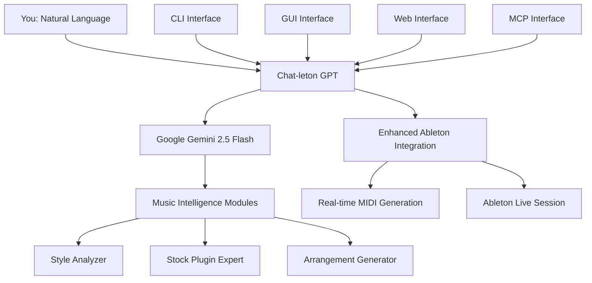

# Chat-leton GPT - AI Music Producer for Ableton Live
**Your personal AI music production assistant powered by Google Gemini 2.5 Flash. Create complete, professional tracks from simple natural language requests - think "Suno for Ableton Live".**

[](https://opensource.org/licenses/MIT)
[](https://www.python.org/downloads/)
[](https://www.ableton.com/)
[](https://ai.google.dev/)

---

## 🎵 **What is Chat-leton GPT?**

Chat-leton GPT is a revolutionary AI music production assistant that transforms simple text requests into complete, professional tracks in Ableton Live. Unlike other AI music generators, it works **inside your DAW** using only **stock plugins**, making professional music production accessible to everyone.

**Transform this conversation:**
```
👤 "Create an Afro House track in the style of Black Coffee at 122 BPM"
🤖 "Analyzing Afro House style... Creating track structure... 
    Generating MIDI patterns... Setting up instruments...
    Track created with 8 parts: kick, bass, hi-hats, percussion, 
    vocal chops, organic pads, and atmospheric layers!"
```

**Into a complete Ableton Live session with:**
- ✅ Professional arrangement structure
- ✅ Style-accurate MIDI patterns  
- ✅ Optimized stock plugin settings
- ✅ Professional mixing template
- ✅ Real-time generation in your DAW

---

## 🚀 **Key Features**

### **🎼 Complete Track Generation**
- **Natural Language Input**: "Create a deep house track like Keinemusik"
- **Full Arrangements**: Intro → Verse → Chorus → Breakdown → Outro
- **Professional Structure**: Industry-standard song layouts
- **Real-time Creation**: Watch tracks build live in Ableton

### **🎨 Deep Style Intelligence**  
- **Genre Mastery**: Afro House, Deep House, Progressive House, Tech House
- **Artist Signatures**: Black Coffee, Keinemusik, Eric Prydz, Dixon
- **Musical DNA**: Understanding of chord progressions, rhythmic patterns, sound palettes
- **Cultural Context**: Authentic style reproduction with cultural awareness

### **🛠️ Stock Plugin Expertise**
- **Wavetable Mastery**: Advanced synthesis for leads, bass, and textures
- **Impulse Programming**: Complete drum kit programming
- **Effect Chains**: Professional processing templates
- **No External Plugins Required**: Everything uses Ableton's built-in tools

### **💬 Multiple Interfaces**
- **🖥️ CLI Chat**: Terminal-based conversation with your AI producer
- **🖼️ Desktop GUI**: Beautiful desktop application with real-time feedback
- **🌐 Web Interface**: Modern browser-based control panel
- **🔗 MCP Integration**: Works with Claude Desktop, Cursor, and other AI assistants

### **⚡ Real-time Ableton Integration**
- **Live Connection Monitoring**: Always know your Ableton status
- **Instant Track Creation**: MIDI generation happens in real-time
- **Progress Feedback**: Watch generation happen step-by-step
- **Error Recovery**: Robust connection handling

---

## 🎯 **The "Suno for Ableton" Vision**

Unlike cloud-based AI music generators, Chat-leton GPT:

| Traditional AI Music | Chat-leton GPT |
|---------------------|----------------|
| ❌ Cloud-based black box | ✅ Works in your DAW |
| ❌ Limited style control | ✅ Deep style understanding |
| ❌ Can't edit results | ✅ Full project access |
| ❌ Requires expensive plugins | ✅ Stock plugins only |
| ❌ No learning workflow | ✅ Learn as you create |

**Perfect for:**
- 🎵 **Producers** wanting instant inspiration and starting points
- 🎓 **Students** learning music production techniques
- 🎤 **Songwriters** needing professional backing tracks
- 🎛️ **Beatmakers** exploring new genres and styles
- 🏠 **Home Studio Musicians** without expensive plugin collections

---

## ⚡ **Quick Start (10 Minutes)**

### **1. Clone & Install**
```bash
git clone https://github.com/l33tdawg/chatleton-ableton-mcp.git
cd chatleton-ableton-mcp
pip install -r requirements.txt
```

### **2. Get Your Google AI API Key**
1. Visit: https://aistudio.google.com/app/apikey
2. Create API key
3. Set it: `export GOOGLE_AI_API_KEY="your-key-here"`

### **3. Launch Chat-leton GPT**
```bash
python launch_chatleton.py
```

Choose your interface:
- **1. 🖥️ CLI Chat** - Terminal conversation (works without Ableton)
- **2. 🖼️ Desktop GUI** - Beautiful desktop app 
- **3. 🌐 Web Interface** - Modern browser control panel

### **4. Try Without Ableton First**
Start with CLI mode to test the AI:
```
👤 "Analyze the characteristics of Afro House music"
👤 "What plugins would you use for a Black Coffee style track?"
👤 "Create a chord progression for deep house"
```

### **5. Optional: Connect to Ableton Live**
For real track generation:

1. **Copy Remote Script:**
   ```bash
   # Mac
   cp -r AbletonMCP_Remote_Script ~/Library/Preferences/Ableton/Live\ */User\ Remote\ Scripts/AbletonMCP
   
   # Windows  
   copy AbletonMCP_Remote_Script "C:\Users\%USERNAME%\Documents\Ableton\User Library\Remote Scripts\AbletonMCP"
   ```

2. **Configure Ableton:**
   - Preferences → Link, Tempo & MIDI
   - Control Surface: "AbletonMCP"
   - Input/Output: "None"

3. **Start Generating:**
   ```
   👤 "Create an Afro House track at 122 BPM in the style of Black Coffee"
   ```

---

## 🎛️ **Interface Options**

### **🖥️ CLI Chat Interface**
Perfect for terminal users and quick conversations:
```bash
python chatleton_gpt.py --cli
```

### **🖼️ Desktop GUI Application**  
Beautiful desktop app with real-time status:
```bash
python chatleton_gpt.py --gui
```

### **🌐 Web Interface**
Modern browser-based control panel:
```bash
python chatleton_web.py
# Open: http://localhost:8000
```

### **🔗 MCP Integration**
Use with Claude Desktop, Cursor, or other MCP-compatible AI assistants:
```json
{
  "mcpServers": {
    "ChatletonGPT": {
      "command": "python",
      "args": ["/path/to/chatleton-ableton-mcp/enhanced_mcp_tools.py"]
    }
  }
}
```

---

## 🎨 **Style Examples**

### **Afro House (Black Coffee Style)**
```
👤 "Create an Afro House track at 122 BPM with organic percussion and warm basslines"

🤖 Generated:
   - Deep, warm kick pattern
   - Organic percussion layers (shakers, congas, bongos)
   - Warm, rolling bassline in Am
   - Vocal chops with traditional African elements
   - Atmospheric pads and string sections
   - Professional arrangement: 8 bars intro → 32 bars verse → etc.
```

### **Deep House (Keinemusik Style)**
```
👤 "Make a sophisticated deep house track like Keinemusik with jazz influences"

🤖 Generated:
   - Vintage electric piano chords (Wavetable + effects)
   - Swinging drum pattern with jazz-inspired hi-hats  
   - Sophisticated chord progression: Dm7 - G7 - CM7 - Am7
   - Warm analog-style bassline
   - Vinyl-inspired effects and saturation
```

### **Progressive House Anthem**
```
👤 "Create an epic progressive house anthem with massive builds"

🤖 Generated:
   - Epic lead synthesizer (Wavetable)
   - Driving, four-on-the-floor kick pattern
   - Emotional breakdown with strings and vocals
   - Progressive arrangement with tension builds
   - Reverb-soaked atmospheric elements
```

---

## 🧠 **AI Music Intelligence**

### **Style Analyzer**
- **Musical DNA Understanding**: Chord progressions, rhythm patterns, sound textures
- **Artist Signature Recognition**: Unique production techniques and characteristics  
- **Cultural Context Awareness**: Authentic representation of musical traditions
- **Harmonic Analysis**: Advanced chord theory and progression generation

### **Stock Plugin Expert**
- **Wavetable Synthesis**: 500+ specialized presets for different genres
- **Effect Chain Templates**: Professional processing chains for every style
- **Impulse Drum Programming**: Genre-specific drum kit setups
- **Mixing Guidelines**: Professional mixing approaches per style

### **Arrangement Intelligence**
- **Song Structure Templates**: Industry-standard arrangements
- **Energy Curve Planning**: Optimal tension and release patterns
- **Transition Generation**: Smooth, professional transitions between sections
- **Build and Breakdown Logic**: Dynamic arrangement elements

---

## 🛠️ **Technical Architecture**



### **Core Components**

**🧠 GeminiOrchestrator**
- Main AI brain powered by Google Gemini 2.5 Flash
- Creative brief generation and analysis
- Natural language understanding for music requests

**🎵 StyleAnalyzer** 
- Deep musical style database
- Artist signature recognition
- Cultural and musical context understanding

**🎛️ StockPluginExpert**
- Comprehensive Ableton stock plugin knowledge
- Genre-specific preset libraries
- Professional effect chain templates

**⚡ EnhancedAbletonIntegration**
- Real-time Ableton Live connection
- MIDI generation and track creation
- Connection monitoring and error recovery

---

## 📚 **Available Commands**

### **Track Generation**
- `"Create an [GENRE] track at [BPM] BPM"`
- `"Generate a [ARTIST NAME] style track"`
- `"Make a track in the style of [REFERENCE SONG]"`

### **Style Analysis**
- `"Analyze the characteristics of [GENRE]"`
- `"What makes [ARTIST] unique?"`
- `"Explain the musical elements of [STYLE]"`

### **Production Guidance**
- `"What plugins should I use for [GENRE]?"`
- `"How do I achieve [SPECIFIC SOUND]?"`
- `"Create a chord progression for [STYLE]"`

### **Project Management**  
- `"What's the status of my Ableton connection?"`
- `"Show me my current session info"`
- `"Help me arrange this track"`

---

## 🎓 **Learning & Education**

Chat-leton GPT isn't just a generator - it's a **music production teacher**:

### **Learn While You Create**
- **Technique Explanations**: Understand why certain choices are made
- **Plugin Education**: Learn Ableton's stock plugins deeply
- **Music Theory Integration**: Chord progressions, scales, and harmony
- **Production Tips**: Professional mixing and arrangement advice

### **Style Deep Dives**
- **Cultural Context**: Understanding the roots and evolution of genres
- **Artist Analysis**: What makes each producer unique
- **Technical Breakdown**: How to achieve signature sounds
- **Historical Perspective**: Genre development and influences

---

## 🔧 **Troubleshooting**

### **Common Issues**

**❌ "Connection Refused" Error**
```bash
# Start the MCP server manually:
python MCP_Server/server.py

# Or check if Ableton Remote Script is installed correctly
```

**❌ "API Key Not Set"**
```bash
export GOOGLE_AI_API_KEY="your-key-here"
# Add to your ~/.bashrc or ~/.zshrc for persistence
```

**❌ "Module Not Found"**
```bash
pip install -r requirements.txt
# Ensure all dependencies are installed
```

### **Testing**
```bash
# Test AI functionality (works without Ableton):
python test_ai_producer.py

# Test Ableton connection:
python test_ableton_integration.py --quick

# Interactive test with troubleshooting:
python test_ableton_integration.py --interactive
```

---

## 🚀 **What's Next**

### **Phase 1: Foundation** ✅
- ✅ Google Gemini 2.5 Flash integration
- ✅ Comprehensive style database
- ✅ Stock plugin expert system
- ✅ Multiple interface options

### **Phase 2: Intelligence** 🚧
- 🔄 Advanced sample curation system
- 🔄 Harmonic progression AI
- 🔄 Professional arrangement templates
- 🔄 Sound design automation

### **Phase 3: Community** 📅
- 📅 Style sharing marketplace
- 📅 Collaborative track generation
- 📅 Integration with streaming platforms
- 📅 Educational content library

---

## 🤝 **Contributing**

We welcome contributions! Areas where help is needed:

- **🎵 Style Database**: Adding new genres and artist styles
- **🎛️ Plugin Presets**: Creating more stock plugin templates
- **🌍 Localization**: Multi-language support
- **📱 Mobile Apps**: iOS/Android interfaces
- **🎓 Educational Content**: Tutorials and learning materials

---

## 📄 **License**

This project is licensed under the MIT License - see [LICENSE](LICENSE) for details.

---

## 🙏 **Acknowledgments**

**Built Upon:**
- Original [ableton-mcp](https://github.com/ahujasid/ableton-mcp) by Sid Ahuja
- Extended and completely reimagined as a standalone AI music producer

**Powered By:**
- [Google Gemini 2.5 Flash](https://ai.google.dev/) - AI orchestration
- [Model Context Protocol](https://github.com/modelcontextprotocol) - AI integration
- [Ableton Live](https://www.ableton.com) - Digital audio workstation

**Music Production Community:**
- Black Coffee, Keinemusik, Eric Prydz, and countless artists who inspire
- The Ableton Live user community
- Music producers worldwide pushing creative boundaries

---

<div align="center">

**🎵 Made with ❤️ for Music Producers Everywhere 🎵**

*Your next hit track is just a conversation away.*

**[⭐ Star this repo](https://github.com/l33tdawg/chatleton-ableton-mcp) | [🐛 Report Issues](https://github.com/l33tdawg/chatleton-ableton-mcp/issues) | [💬 Join Discussions](https://github.com/l33tdawg/chatleton-ableton-mcp/discussions)**

</div> 
