# 🎵 Ableton MCP Extended
**Control Ableton Live with AI - Create music through natural conversation**

> *"Hey Claude, create a chill lo-fi beat with a warm bass, add some vinyl crackle, and generate a voice saying 'welcome to the vibe'"*  
> ✨ *Minutes later, you have a complete track.*

[](https://opensource.org/licenses/MIT)
[](https://www.python.org/downloads/)
[](https://www.ableton.com/)

---

## 🚀 What This Does

Imagine controlling Ableton Live just by talking to an AI assistant. No more clicking through menus, dragging samples, or remembering complex key combinations. Just describe what you want, and watch your musical ideas come to life.

**Transform this conversation:**
```
👤 "Create a brief minimalist/neo-classical composition in a style similar to Ólafur Arnalds'. (Ableton MCP) / I've loaded four MIDI tracks called "Noire" and "Noire (2) ["Emotional Felt" presets], "Noire (2) ["Reversed Felt" preset, for ambient background], and "Noire (3) ["Ethereal Felt" preset, also for ambient background]. All loaded with nice piano instruments. You have also a MIDI track called "Strings" with a nice string ensemble instrument loaded. Feel free to add new instruments and effects, if pertinent."
🤖 "Creating MIDI clips... Adding effects... Done!"
👤 "Then, use ElevenLabs MCP to create a spoken-word audio clip (default voice and settings) with a relevant poem in the style of “Jim Morrison” to accompany the composition."  
🤖 "Generating poem... Transforming it into speech... Importing it into your session... Done!"
```

**Into this music production session** ⬇️

https://github.com/user-attachments/assets/d6ef2de5-bdeb-4097-acc0-67d70f7f85b3

---

## ✨ Key Features

### 🎯 **AI-Powered Music Creation**
- **Natural Language Control**: "Add a reverb to track 2" → Done instantly
- **Intelligent Track Building**: AI understands music theory and production techniques
- **Creative Assistance**: Get suggestions for chord progressions, drum patterns, and arrangements

### 🎤 **Voice & Audio Generation** 
- **Text-to-Speech Integration**: Generate narration, vocal samples, or spoken elements
- **Custom Voice Creation**: Clone voices for unique character in your tracks  
- **Sound Effects**: Create custom SFX with AI ("generate the sound of rain on a window")
- **Direct Import**: Generated audio appears instantly in your Ableton session

### 🎮 **Extensible Framework for Custom Tools**
- **Example: XY Mouse Controller**: Demonstrates creating custom Ableton controllers with the MCP framework
- **Ultra-Low Latency**: High-performance UDP protocol enables responsive real-time control
- **Unlimited Possibilities**: Build your own custom tools and controllers for Ableton Live

### 🔧 **Professional Integration**
- **Ableton API Access**: Control over tracks, clips, effects, and automation
- **Non-Destructive Workflow**: Works alongside your existing production process
- **Multiple AI Assistants**: Compatible with Claude Desktop and Cursor

---

## 🏃‍♂️ Quick Start (5 Minutes)

### Prerequisites
- Ableton Live 11+ (any edition)
- Python 3.10 or higher
- Claude Desktop or Cursor IDE

### 1. **Get the Code**
```bash
git clone https://github.com/uisato/ableton-mcp-extended.git
cd ableton-mcp-extended
pip install -e .
```

### 2. **Install Ableton Script**
1. Find your Ableton Remote Scripts folder:
   - **Windows**: `C:\Users\[You]\Documents\Ableton\User Library\Remote Scripts\`
   - **Mac**: `~/Library/Preferences/Ableton/Live [Version]/User Remote Scripts/`
2. Create folder: `AbletonMCP`
3. Copy `AbletonMCP_Remote_Script/__init__.py` into this folder

### 3. **Configure Ableton**
1. Open Ableton Live
2. Go to **Preferences** → **Link, Tempo & MIDI**
3. Set **Control Surface** to "AbletonMCP"
4. Set Input/Output to "None"

### 4. **Connect AI Assistant**

**For Claude Desktop:**
```json
{
  "mcpServers": {
    "AbletonMCP": {
      "command": "python",
      "args": ["C:/path/to/ableton-mcp-extended/MCP_Server/server.py"]
    }
  }
}
```

**For Cursor:**
Add MCP server in Settings → MCP with the same path.

### 5. **Start Creating! 🎉**
Open your AI assistant and try:
- *"Create a new MIDI track with a piano"*
- *"Add a simple drum beat"*
- *"What tracks do I currently have?"*

---

## 🎼 What You Can Create

### 🥁 **Rhythm & Beats**
```
"Create a trap-style drum pattern with hi-hats on every 16th note"
"Add a kick drum that hits on beats 1 and 3 with a slight swing"
"Layer in some percussion fills every 4 bars"
```

### 🎹 **Melodies & Harmony**  
```
"Create a sad piano melody in D minor"
"Add warm pad chords that follow a I-vi-IV-V progression"
"Generate a bass line that complements the existing chords"
```

### 🎤 **Vocals & Voice**
```
"Generate a voice saying 'Welcome to the future of music'"
"Create a robotic voice effect for this vocal sample"  
"Add some breath sounds and vocal texture to track 3"
```

### 🎛️ **Effects & Processing**
```
"Add some vintage tape saturation to the drums"
"Create a filter sweep automation on the synth lead"
"Apply some spatial reverb to create depth"
```

---

## 📊 How It Works

```mermaid
graph TB
    A[You: Natural Language] --> B[AI Assistant]
    B --> C[MCP Server]
    C --> D[Ableton Remote Script]
    D --> E[Ableton Live]
    E --> F[🎵 Your Music]
    
    G[ElevenLabs AI] --> H[Generated Audio]
    H --> C
```



1. **You speak naturally** to Claude or Cursor
2. **AI understands** your musical intent
3. **MCP Server** translates to Ableton commands
4. **Remote Script** executes in Ableton Live
5. **Your music** is created instantly

---

## 🔧 Advanced Features

<details>
<summary><strong>🚀 High-Performance Mode (UDP Server)</strong></summary>

For real-time parameter control with ultra-low latency:

```bash
# Install the hybrid server
cp -r Ableton-MCP_hybrid-server/AbletonMCP_UDP/ ~/Remote\ Scripts/AbletonMCP_UDP/

# Try the XY Mouse Controller example
cd experimental_tools/xy_mouse_controller
python mouse_parameter_controller_udp.py
```

This demonstrates how to build:
- Custom real-time controllers for Ableton
- Expressive performance tools
- Interactive music applications
</details>

<details>
<summary><strong>🎤 ElevenLabs Voice Integration</strong></summary>

Generate professional voice content:

```json
{
  "mcpServers": {
    "ElevenLabs": {
      "command": "python",
      "args": ["path/to/elevenlabs_mcp/server.py"],
      "env": {
        "ELEVENLABS_API_KEY": "your-api-key"
      }
    }
  }
}
```

Try:
- *"Generate a deep movie trailer voice saying 'In a world...'"*
- *"Create a cheerful announcement for my podcast intro"*
- *"Make a robotic voice explaining the breakdown section"*
</details>

---

## 💡 Examples & Inspiration

### 🎵 **Complete Song Creation**
*"Create a chill lo-fi hip-hop track with vinyl crackle, warm bass, and soft piano"*

### 🎬 **Podcast Production**  
*"Generate intro music, add a professional voice-over, and create smooth transitions"*

### 🎮 **Game Music**
*"Build an 8-bit style soundtrack with retro drums and chiptune melodies"*

### 🎭 **Experimental Soundscapes**
*"Create an ambient piece with evolving textures and spatial effects"*

---

## 🛠️ Components Overview

This project includes several specialized components:

### 🖥️ **Core MCP Server**
- Standard TCP communication for reliable AI control
- Full Ableton Live API integration
- Compatible with Claude Desktop and Cursor

### ⚡ **Hybrid TCP/UDP Server** 
- High-performance real-time parameter control
- Ultra-low latency for live performance
- Perfect for controllers and interactive tools

### 🎤 **ElevenLabs Integration**
- Professional text-to-speech generation
- Custom voice creation and cloning
- Direct import into Ableton sessions
- Real-time SFX generation

### 🎮 **Experimental Tools & Examples**
- **XY Mouse Controller**: Example demonstrating how to build custom Ableton controllers
- **Extensible Framework**: Foundation for creating your own control interfaces
- **Proof of Concept**: Shows the power and flexibility of the MCP approach

---

## 📚 Documentation

- **[Installation Guide](INSTALLATION.md)** - Detailed setup instructions
- **[User Guide](README.md)** - What, which, and how  

---

## 🤝 Community & Support

- **GitHub Issues**: Bug reports and feature requests
- **Discussions**: Share your creations and get help
- **Wiki**: Community-contributed tips and tricks

### 🎬 **Share Your Creations**
Tag us with your AI-generated music! We love seeing what the community creates.

---

## 🔮 What's Next

We're constantly improving Ableton MCP Extended:

- 🎛️ **VST Plugin Support** - Control third-party plugins  
- 🎼 **Arrangement View** - Full timeline control
- 🎹 **Hardware Integration** - Bridge MIDI controllers through AI
- 🤖 **Advanced AI** - Smarter music understanding and generation
- 🌐 **Web Interface** - Browser-based control panel

---

## 📄 License & Credits

This project is licensed under the MIT License - see [LICENSE](LICENSE) for details.

**Built with:**
- [Model Context Protocol](https://github.com/modelcontextprotocol) - AI integration framework
- [ElevenLabs API](https://elevenlabs.io) - Professional voice generation
- [Ableton Live](https://www.ableton.com) - Digital audio workstation

**Inspired by:** The original [ableton-mcp](https://github.com/ahujasid/ableton-mcp) project

---

## 🚀 Ready to Transform Your Music Production?

**[⬇️ Get Started Now](#-quick-start-5-minutes)** | **[📖 Read the Docs](INSTALLATION.md)** | **[🎵 See Examples](docs/EXAMPLES.md)**

*Transform your creative process. Make music through conversation. Welcome to the future of music production.*

---

<div align="center">

**Made with ❤️ for the music production community**

*If this project helps your creativity, consider giving it a ⭐ star!*

</div> 
