# Ableton MCP Extended
**Control Ableton Live using natural language via AI assistants like Claude or Cursor. This project provides a robust Model Context Protocol (MCP) server that translates conversational commands into precise actions within your Ableton Live session.**

[](https://opensource.org/licenses/MIT)
[](https://www.python.org/downloads/)
[](https://www.ableton.com/)

---

This tool is designed for producers, developers, and AI enthusiasts who want to streamline their music production workflow, experiment with generative music, and build custom integrations with Ableton Live.

**You can transform this conversation:**
```
👤 "Create a brief minimalist/neo-classical composition in a style similar to Ólafur Arnalds'. (Ableton MCP) / I've loaded four MIDI tracks called "Noire" and "Noire (2) ["Emotional Felt" presets], "Noire (2) ["Reversed Felt" preset, for ambient background], and "Noire (3) ["Ethereal Felt" preset, also for ambient background]. All loaded with nice piano instruments. You have also a MIDI track called "Strings" with a nice string ensemble instrument loaded. Feel free to add new instruments and effects, if pertinent."
🤖 "Creating MIDI clips... Adding effects... Done!"
👤 "Then, use ElevenLabs MCP to create a spoken-word audio clip (default voice and settings) with a relevant poem in the style of “Jim Morrison” to accompany the composition."  
🤖 "Generating poem... Transforming it into speech... Importing it into your session... Done!"
```

**Into this music production session**:

https://github.com/user-attachments/assets/d6ef2de5-bdeb-4097-acc0-67d70f7f85b3

---

## Key Features

This project provides comprehensive, programmatic control over the Ableton Live environment.

* **Session and Transport Control:**
    * Start and stop playback.
    * Get session info, including tempo, time signature, and track count.
    * Manage scenes: create, delete, rename, and fire.

* **Track Management:**
    * Create, rename, and get detailed information for MIDI and audio tracks.
    * Control track properties: volume, panning, mute, solo, and arm.
    * Manage track grouping and folding states.

* **MIDI Clip and Note Manipulation:**
    * Create and name MIDI clips with specified lengths.
    * Add, delete, transpose, and quantize notes within clips.
    * Perform batch edits on multiple notes in a single operation.
    * Adjust clip loop parameters and follow actions.

* **Device and Parameter Control:**
    * Load instruments and effects from Ableton's browser by URI.
    * Get a full list of parameters for any device on a track.
    * Set and batch-set device parameters using normalized values (0.0 to 1.0).

* **Automation and Envelopes:**
    * Add and clear automation points for any device parameter within a clip. [This feature isn't working perfectly yet.]
    * Get information about existing clip envelopes.

* **Browser Integration:**
    * Navigate and list items from Ableton's browser.
    * Load instruments, effects, and samples directly from a browser path or URI.
    * Import audio files directly into audio tracks or clip slots.

* **Voice & Audio Generation** 
    * Text-to-Speech Integration: Generate narration, vocal samples, or spoken elements through ElevenLabs MCP [included].
    * Custom Voice Creation: Clone voices for unique character in your tracks  
    * Sound Effects: Create custom SFX with AI
    * Direct Import: Generated audio appears instantly in your Ableton session

* **Extensible Framework for Custom Tools**
    * Example: XY Mouse Controller: Demonstrates creating custom Ableton controllers with the MCP framework
    * Ultra-Low Latency: High-performance UDP protocol enables responsive real-time control
    * Unlimited Possibilities: Build your own custom tools and controllers for Ableton Live

---

##  Quick Start (5 Minutes)

### Prerequisites
- Ableton Live 11+ (any edition)
- Python 3.10 or higher
- Claude Desktop or Cursor IDE

### 1. **Get the Code**
```bash
git clone https://github.com/uisato/ableton-mcp-extended.git
cd ableton-mcp-extended
pip install -e .
```

### 2. **Install Ableton Script**
1. Find your Ableton Remote Scripts folder:
   - **Windows**: `C:\Users\[You]\Documents\Ableton\User Library\Remote Scripts\`
   - **Mac**: `~/Library/Preferences/Ableton/Live [Version]/User Remote Scripts/`
2. Create folder: `AbletonMCP`
3. Copy `AbletonMCP_Remote_Script/__init__.py` into this folder

### 3. **Configure Ableton**
1. Open Ableton Live
2. Go to **Preferences** → **Link, Tempo & MIDI**
3. Set **Control Surface** to "AbletonMCP"
4. Set Input/Output to "None"

### 4. **Connect AI Assistant**

**For Claude Desktop:**
```json
{
  "mcpServers": {
    "AbletonMCP": {
      "command": "python",
      "args": ["C:/path/to/ableton-mcp-extended/MCP_Server/server.py"]
    }
  }
}
```

**For Cursor:**
Add MCP server in Settings → MCP with the same path.

### 5. **Start Creating! **
Open your AI assistant and try:
- *"Create a new MIDI track with a piano"*
- *"Add a simple drum beat"*
- *"What tracks do I currently have?"*

---

## How It Works

```mermaid
graph TB
    A[You: Natural Language] --> B[AI Assistant]
    B --> C[MCP Server]
    C --> D[Ableton Remote Script]
    D --> E[Ableton Live API]
    E --> F[🎵 Your Music]
    
    G[ElevenLabs AI] --> H[Generated Audio]
    H --> C
```



1. You issue a command in plain English to your AI assistant (e.g., "Create a new MIDI track and name it 'Bass'").
2. The AI Assistant understands the intent and calls the appropriate tool from the MCP server.
3. The MCP Server (server.py) receives the tool call and constructs a specific JSON command.
4. The Ableton Remote Script (__init__.py), running inside Live, receives the JSON command via a socket connection.
5. The Remote Script executes the command using the official Ableton Live API, making the change in your session instantly.

---

## Advanced Features

<details>
<summary><strong>🚀 High-Performance Mode (UDP Server)</strong></summary>


For real-time parameter control with ultra-low latency:

```bash
# Install the hybrid server
cp -r Ableton-MCP_hybrid-server/AbletonMCP_UDP/ ~/Remote\ Scripts/AbletonMCP_UDP/

# Try the XY Mouse Controller example
cd experimental_tools/xy_mouse_controller
python mouse_parameter_controller_udp.py
```

This demonstrates how to build:
- Custom real-time controllers for Ableton
- Expressive performance tools
- Interactive music applications
</details>

<details>
<summary><strong>🎤 ElevenLabs Voice Integration</strong></summary>


This repository can be integrated with other MCP servers, such as one for ElevenLabs, to generate and import audio directly into your project.

Set up the ElevenLabs MCP server according to its instructions.

Update your AI assistant's config to include both servers.

Example mcp-config.json:

```json
{
  "mcpServers": {
    "AbletonMCP": {
      "command": "python",
      "args": ["/path/to/ableton-mcp-extended/server.py"]
    },
    "ElevenLabs": {
      "command": "python",
      "args": ["/path/to/elevenlabs_mcp/server.py"],
      "env": {
        "ELEVENLABS_API_KEY": "your-api-key-here"
      }
    }
  }
}
```

</details>

---

## Components Overview

This project includes several specialized components:

### **Core MCP Server**
- Standard TCP communication for reliable AI control
- Extensive Ableton Live API integration
- Compatible with Claude Desktop, Cursor, and Gemini CLI.

### **Hybrid TCP/UDP Server** 
- High-performance real-time parameter control
- Ultra-low latency for live performance
- Perfect for controllers and interactive tools

### **ElevenLabs Integration**
- Professional text-to-speech generation
- Custom voice creation and cloning
- Direct import into Ableton sessions
- Real-time SFX generation

### **Experimental Tools & Examples**
- **XY Mouse Controller**: Example demonstrating how to build custom Ableton controllers
- **Extensible Framework**: Foundation for creating your own control interfaces
- **Proof of Concept**: Shows the power and flexibility of the MCP approach

---

## Documentation

- **[Installation Guide](INSTALLATION.md)** - Detailed setup instructions
- **[User Guide](README.md)** - What, which, and how  

---

## Community & Support

- **GitHub Issues**: Bug reports and feature requests
- **Discussions**: Share your creations and get help

### **Share Your Creations**
Tag me with your AI-generated experiments! I love seeing what the community creates:

[YouTube](https://www.youtube.com/@uisato_) |
[Instagram](https://www.instagram.com/uisato_) |
[Patreon](https://www.patreon.com/c/uisato) |
[Website](https://www.uisato.art/) 

---

## What's Next

We're constantly improving Ableton MCP Extended:

- **Fixing automation points bugs**
- **VST Plugin Support** - Control third-party plugins [Though it can be achieved throught the "Configure" button]
- **Arrangement View** - Full timeline control
- **Hardware Integration** - Bridge MIDI controllers through AI
- **Advanced AI** - Smarter and better music understanding and generation

---

## License & Credits

This project is licensed under the MIT License - see [LICENSE](LICENSE) for details.

**Built with:**
- [Model Context Protocol](https://github.com/modelcontextprotocol) - AI integration framework
- [ElevenLabs API](https://elevenlabs.io) - Professional voice generation
- [Ableton Live](https://www.ableton.com) - Digital audio workstation

**Inspired by:** The original [ableton-mcp](https://github.com/ahujasid/ableton-mcp) project

---

<div align="center">

**Made with ❤️ for the music production community**

*If this project helps your creativity, consider giving it a ⭐ star!*

</div> 
